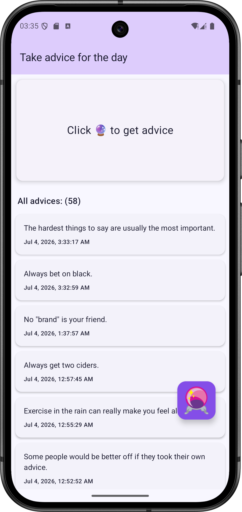
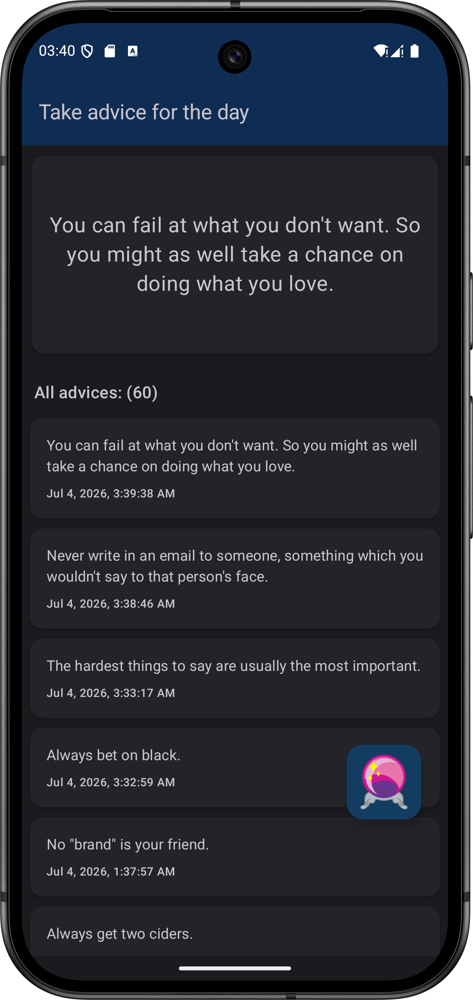
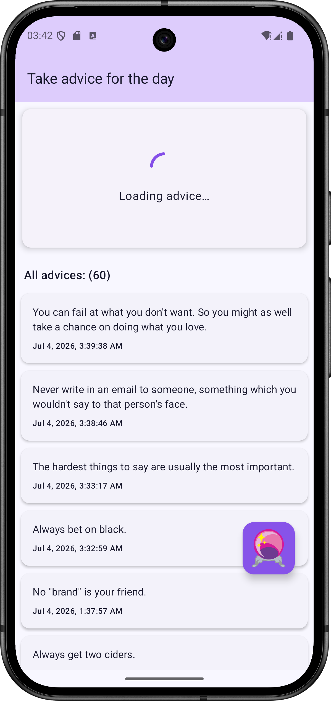
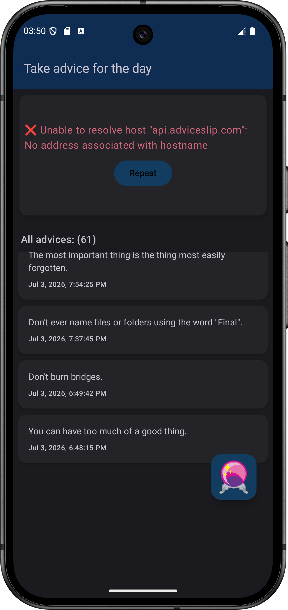

# AProject 🎉

A fun and entertaining Android app that delivers interesting advice from an API. 
Built with modern Android stack — the project is actively growing, with more fun features on the way.

---

## 🚀 Features

- 🎲 Get a random interesting piece of advice at the tap of a button
- 💾 Save your favorite advice for later with Room Database
- 🌐 Real-time data from an external API using Retrofit
- 🌙 Full light and dark theme support
- 🎨 Clean, modern UI built entirely with Jetpack Compose
- 🧩 Modular and scalable architecture ready for new features

---

## 🛠️ Tech Stack

**Language**
- Kotlin

**UI**
- Jetpack Compose

**Architecture**
- MVVM · Repository Pattern · Clean Architecture

**Dependency Injection**
- Dagger Hilt

**Networking**
- Retrofit · OkHttp · Gson

**Local Storage**
- Room Database

**Tools**
- Android Studio · Git · Gradle

---


## 📸 Screenshots

### Advice Screen States

|                  Light Theme                  |                 Dark Theme                  |
|:---------------------------------------------:|:-------------------------------------------:|
|  |  |

|                   Loading State                   |                           Connection Error & List End                            |
|:-------------------------------------------------:|:--------------------------------------------------------------------------------:|
|  |  |
---

## 🚀 Setup & Installation

1. Clone the repository:
   ```bash
   git clone https://github.com/Elige23/AProject.git
    ```
2. Open the project in Android Studio
3. Sync Gradle files
4. Run on emulator or physical device

---

## 📄 License
This project is licensed under the MIT License — see the [LICENSE](LICENSE) file for details.

---

## 📞 Contact
- **Email:** kazlova.viktoryia@gmail.com
- **LinkedIn:** [Viktoryia Kazlova](https://www.linkedin.com/in/viktoryia-kazlova/)